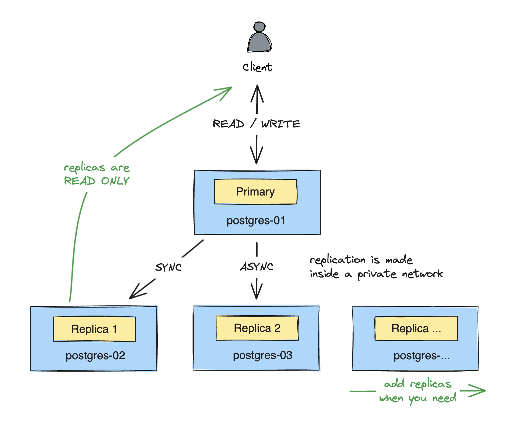

<!-- BEGIN_TF_DOCS -->

# PostgreSQL Cluster Terraform Module

This Terraform module is designed to deploy a PostgreSQL high-availability cluster on Elestio with the following features:

- 🔄 Async or synchronous replicas
- ⬆️ Scaling up and down
- 🔀 Manual failover
- 🔒 SSL certificates
- 🔑 Changing secrets


## Architecture

Primary node accepts write and read operations.
Replicas are read-only and replicate the primary node's data.
Replication can be synchronous or asynchronous for each replica individually.



## Requirements

Elestio is a platform we developed to help you deploy open-source services without spending weeks configuring them.
Services are simply deployed with important features: security, monitoring, backups, updates, and more...

To use this module, you need to have an Elestio account. 

- [Create an account](https://dash.elest.io/signup)
- [Receive free credits](https://docs.elest.io/books/billing/page/free-trial)

## Usage

If you want a complete ready-to-use configuration, follow the [Getting Started](#getting-started) section.

For experienced Terraform/Elestio users, this is the module's block usage:

```hcl
module "cluster" {
  source = "elestio-examples/postgresql-cluster/elestio"

  project_id = "12345"

  configuration_ssh_key = {
    username    = "terraform"
    public_key  = chomp(file("./terraform_rsa.pub"))
    private_key = file("./terraform_rsa")
  }

  postgresql_password             = "*****"
  postgresql_replication_password = "*****"
  postgresql_replication_user     = "replicator" # optional
  synchronous_standby_names       = ""           # optional
  synchronous_commit              = "on"         # optional

  ssl_ca_key = file("./ca.key")

  nodes = {
    primary = {
      server_name   = "postgres-01"
      provider_name = "hetzner"
      datacenter    = "fsn1"
      server_type   = "SMALL-1C-2G"
    }
    replicas = [
      {
        server_name   = "postgres-02"
        provider_name = "hetzner"
        datacenter    = "hel1"
        server_type   = "SMALL-1C-2G"
      },
      {
        server_name   = "postgres-03"
        provider_name = "scaleway"
        datacenter    = "fr-par-1"
        server_type   = "SMALL-2C-2G"
      }
    ]
  }
}
```

## Getting Started

In this example, we will deploy a PostgreSQL cluster with two asynchronous replicas.

### 1. Install Terraform

Follow the instructions of your operating system on https://learn.hashicorp.com/tutorials/terraform/install-cli

### 2. Copy-Paste Configuration

Create a new directory on your machine.

We will create the following files:

```response
.
├── main.tf             # The main configuration file
├── terraform.tfvars    # The sensitive variables file
├── terraform_rsa       # SSH private key
├── terraform_rsa.pub   # SSH public key
├── ca.key              # SSL CA private key
└── .gitignore          # To avoid committing sensitive data
```

Copy-paste the following content into the files:

<details>
<summary><code>main.tf</code></summary>

```hcl
variable "elestio_email" {
  type      = string
  sensitive = true
}

variable "elestio_api_token" {
  type      = string
  sensitive = true
}

variable "postgresql_password" {
  type      = string
  sensitive = true
}

variable "postgresql_replication_password" {
  type      = string
  sensitive = true
}

terraform {
  required_providers {
    elestio = {
      source  = "elestio/elestio"
      version = ">= 0.18.0"
    }
  }
}

provider "elestio" {
  email     = var.elestio_email
  api_token = var.elestio_api_token
}

resource "elestio_project" "project" {
  name = "pg-primary-replicas"
}

module "cluster" {
  source = "../.."

  project_id = elestio_project.project.id

  configuration_ssh_key = {
    username = "terraform"
    # Generate command: "ssh-keygen -t rsa -f terraform_rsa"
    public_key  = chomp(file("./terraform_rsa.pub"))
    private_key = file("./terraform_rsa")
  }

  postgresql_password             = var.postgresql_password
  postgresql_replication_password = var.postgresql_replication_password
  postgresql_replication_user     = "replicator" # optional
  synchronous_standby_names       = ""           # optional
  synchronous_commit              = "on"         # optional

  # Generate command: "openssl genrsa -out ca.key 4096"
  ssl_ca_key = file("./ca.key")

  nodes = {
    primary = {
      server_name   = "postgres-01"
      provider_name = "hetzner"
      datacenter    = "fsn1"
      server_type   = "SMALL-1C-2G"
    }
    replicas = [
      {
        server_name   = "postgres-02"
        provider_name = "hetzner"
        datacenter    = "hel1"
        server_type   = "SMALL-1C-2G"
      },
      {
        server_name   = "postgres-03"
        provider_name = "scaleway"
        datacenter    = "fr-par-1"
        server_type   = "SMALL-2C-2G"
      }
    ]
  }
}

output "nodes_admins" {
  sensitive = true
  value = {
    primary = {
      database = module.cluster.nodes.primary.database_admin
      pgadmin  = module.cluster.nodes.primary.admin
    }
    replicas = {
      for node in module.cluster.nodes.replicas : node.server_name => {
        database = node.database_admin
        pgadmin  = node.admin
      }
    }
  }
}
```

</details>

<details>
<summary><code>terraform.tfvars</code></summary>

```hcl
# Generate your Elestio API token: https://dash.elest.io/account/security
elestio_email     = "john@doe.com"
elestio_api_token = ""

# If you need, you can generate a safe new random password on this Elestio URL: https://api.elest.io/api/auth/passwordgenerator
postgresql_password             = ""
postgresql_replication_password = ""
```

</details>

<details>
<summary><code>.gitignore</code></summary>

```plaintext
# Your local SSH key
terraform_rsa.pub
terraform_rsa

# Local .terraform directories
**/.terraform/*
**/.terraform

# .tfstate files
*.tfstate
*.tfstate.*

# Crash log files
crash.log
crash.*.log

# Exclude all .tfvars files, which are likely to contain sensitive data, such as
# password, private keys, and other secrets. These should not be part of version
# control as they are data points which are potentially sensitive and subject
# to change depending on the environment.
*.tfvars
*.tfvars.json

# Ignore override files as they are usually used to override resources locally and so
# are not checked in
override.tf
override.tf.json
*_override.tf
*_override.tf.json

# Ignore CLI configuration files
.terraformrc
terraform.rc

# Ignore the SSL CA private key
ca.key
```

</details>

Generate the configuration SSH Key:

```bash
ssh-keygen -t rsa -f terraform_rsa
```

Create the CA private key for the SSL:

```bash
openssl genrsa -out ca.key 4096
```

Fill the `terraform.tfvars` file with your Elestio credentials and set your two clusters' passwords.

In the `main.tf` file, you can see the module's configuration.

- The `configuration_ssh_key` is used by the module to connect to the nodes and configure them after initial deployment by Elestio.

- The `ssl_ca_key` is used as root certificate to generate the SSL certificates of each node.

- The root user is by default `postgres` and the replication user is by default `replicator`.

- The `synchronous_standby_names` variable is used to set which replicas are synchronous, and their priority. By default and if empty or not set, all replicas are asynchronous. In this example, the `postgres-02` replica is synchronous.

- A node is identified by its `server_name` value. If you update the `server_name` value of a node, it will be considered as a new node to create, and destroy the old one.
Be carefull, If you update the `server_name` primary value without precautions, the module will clear the data of all the nodes and create a new cluster.

- The list of available providers, datacenters, and server types can be found following this guide: [Providers, datacenters and server types](https://registry.terraform.io/providers/elestio/elestio/latest/docs/guides/providers_datacenters_server_types).

### 3. Deploy the Cluster

Let's install the terraform dependencies:

```bash
terraform init
```

Then apply the configuration to deploy the cluster:

```bash
terraform apply
```

It will show you the resources that will be created and ask for confirmation.

The number of resources created is not the same as the number of nodes in the cluster. The module creates other "null" resources used to configure the nodes (ssl, edit configuration files, start the service, etc).

Type `yes` and press `Enter`.

After a few minutes, the cluster will be deployed. ⏳

After this first deployment, if you edit the configuration, you can run `terraform apply` again and it will show you only the resources that will be updated.

### 4. Output Information

After the deployment, you can output all the terraform state:

```bash
terraform show
```

But the output is big and not very readable.

The configuration you pasted contains custom output to help you get only the information you need.

Try the following commands:

```bash
terraform output nodes_admins
```

### 5. Connect to the Database

Use the primary node information to connect to the database.

Then you can watch the replication status with the following command:

```sql
SELECT * FROM pg_stat_replication;
```

You should see a row for each replica with the `state` column set to `streaming`.

Then you can verify each replica has a replication slot with the following command:

```sql
SELECT * FROM pg_replication_slots;
```

You should see a row for each replica with the `active` column set to `true`.

### 6. Create a Table and Insert Data

Create a table on the primary node:

```sql
CREATE TABLE test (id serial PRIMARY KEY, name text);
```

Insert some data:

```sql
INSERT INTO test (name) VALUES ('hello');
```

Then connect to each replica and check if the data is there:

```sql
SELECT * FROM test;
```

You should see the data on every node.

If you try to insert data on the replicas, you will get an error because they are read-only.

## Synchronous Replication

The `synchronous_standby_names` variable is used to set which replicas are synchronous and their priority.
The default value is an empty string, which means that all replicas are asynchronous.

The PostgreSQL documentation explains the syntax of the `synchronous_standby_names` variable: [Synchronous Replication](https://www.postgresql.org/docs/current/runtime-config-replication.html#GUC-SYNCHRONOUS-STANDBY-NAMES)

Use server names as replicas identifiers.

Few examples:

```hcl
synchronous_standby_names = "postgres-02"
synchronous_standby_names = "postgres-02,postgres-03"
synchronous_standby_names = "ALL"
synchronous_standby_names = "FIRST 1 (postgres-02,postgres-03)"
synchronous_standby_names = "ANY 2 (postgres-02,postgres-03)"
```

Be careful with synchronous replication, it can block write operations if the synchronous replicas are not available.

## Scaling Up or Down

### Vertical Scaling

Vertical scaling means upgrading or downgrading the machine type of the nodes. With Elestio, only upgrading is possible.

To do so, update the `server_type` variable of desired nodes in the configuration and apply again.

The node will be powered off, upgraded, and powered on again.

Usefull link: [Providers, datacenters and server types](https://registry.terraform.io/providers/elestio/elestio/latest/docs/guides/providers_datacenters_server_types)

### Horizontal Scaling

Horizontal scaling means adding or removing replicas to the cluster.

To do so, append or remove a record from the `replicas` variable in the configuration and apply again.

The module will create or destroy the nodes and configure them automatically.

When you add a replica, the module will create automatically a replication slot on the primary node.

**IMPORTANT: When you remove a replica, the module will not remove the replication slot. You must do it manually.**

First, connect to the primary node and execute the following sql command:

```sql
SELECT * FROM pg_replication_slots WHERE active = false;
```

It will show you the inactive slots. You can drop them with the following command:

```sql
SELECT pg_drop_replication_slot('postgres_03_slot');
```

## Changing Secrets

The module allows you to change several secrets at any time:

- The SSH key
- The SSL private key
- The root password
- The replication user and password

For the SSL private key and SSH key, change the files on your machine and run `terraform apply`.

But for others, you must connect to the primary node and execute a command before updating the configuration.

### Changing the Root Password

Before updating the configuration, connect to the primary node and execute the following sql command:

```sql
ALTER USER postgres WITH ENCRYPTED PASSWORD 'new_password';
```

The change will be effective immediately and replicated among the cluster.

Now you can update the `postgresql_password` variable in the `terraform.tfvars` file with your new password and apply terraform.
It will persist the new password in the nodes' files.

### Changing the Replication User

Same as the root password, you can change the replication user at any time but you must execute a sql command before updating the configuration.

For example, to change the replication user from `replicator` to `replicator2`, execute the following sql command on the primary node:

```sql
ALTER USER replicator RENAME TO replicator2;
```

Then update the `postgresql_replication_user` variable in the `main.tf` file and apply terraform.

### Changing the Replication User Password

Execute the following sql command on the primary node:

```sql
ALTER USER replicator2 WITH ENCRYPTED PASSWORD 'new_password';
```

Then update the `postgresql_replication_password` variable in the `terraform.tfvars` file and apply terraform.

## Failover

Only the primary node accepts write operations. If it fails, you can promote one of the replicas to be the new leader.

But you must be careful to avoid data loss.

**Read carefully the following instructions and execute them in the right order.**

Look in your configuration file for the `server_name` of the failing node and the `server_name` of an existing replica.
It's very important to use the `server_name` of an existing replica already deployed with a previous `terraform apply`.

For example, let's say we already deployed the cluster with the following configuration:

```hcl
nodes = {
  primary = {
    server_name   = "postgres-01"
    provider_name = "hetzner"
    datacenter    = "fsn1"
    server_type   = "SMALL-1C-2G"
  }
  replicas = [
    {
      server_name   = "postgres-02"
      provider_name = "hetzner"
      datacenter    = "hel1"
      server_type   = "SMALL-1C-2G"
    },
    {
      server_name   = "postgres-03"
      provider_name = "scaleway"
      datacenter    = "fr-par-1"
      server_type   = "SMALL-2C-2G"
    }
  ]
}
```

But one day, the `postgres-01` node fails. We can promote the existing `postgres-02` or `postgres-03` node to be the new primary node.
In our example, we will promote the `postgres-03` node.

Switch all the block (surrounded by `{}`) of the `primary` node with the block of the `replica` node.

The configuration will look like this:

```hcl
nodes = {
  primary = {
    server_name   = "postgres-03"
    provider_name = "scaleway"
    datacenter    = "fr-par-1"
    server_type   = "SMALL-2C-2G"
  }
  replicas = [
    {
      server_name   = "postgres-02"
      provider_name = "hetzner"
      datacenter    = "hel1"
      server_type   = "SMALL-1C-2G"
    },
    {
      # We switched the primary value with the replica value
      server_name   = "postgres-01"
      provider_name = "hetzner"
      datacenter    = "fsn1"
      server_type   = "SMALL-1C-2G"
    }
  ]
}
```

Now you can apply the configuration:

```bash
terraform apply
```

And voilà! The `postgres-03` node is now the primary node and the `postgres-01` node is now a replica.

-> Watch for typo misstakes!! If you replace primary value with a new server_name that has never been deployed before (like `postgres-04`), the module will clear the data of all the nodes and create a new cluster.

## Inside the Module

You can inspect the module's code on the Github repository or in the `.terraform/modules` directory generated by Terraform.

- It creates a `elestio_postgresql` resource for each node in the cluster.
- It connects to each node and generates SSL certificates.
- Then it connects to the primary node, writes configuration files, starts the PostgreSQL service, and creates the replication user.
- Finally, it connects to each replica, writes configuration files, backs up primary data and starts the PostgreSQL service.

The triggers_replace of the resources are used to handle the changes of the module configuration and update it on the nodes.

## Need help?

If you need any help, you can [open a support ticket](https://dash.elest.io/support/creation) or send an email to [support@elest.io](mailto:support@elest.io).
We are always happy to help you with any questions you may have.


## Inputs

| Name | Description | Type | Default | Required |
|------|-------------|------|---------|:--------:|
| <a name="input_configuration_ssh_key"></a> [configuration\_ssh\_key](#input\_configuration\_ssh\_key) | n/a | <pre>object({<br>    username    = string<br>    public_key  = string<br>    private_key = string<br>  })</pre> | n/a | yes |
| <a name="input_nodes"></a> [nodes](#input\_nodes) | Primary and replicas nodes configuration. | <pre>object({<br>    primary = object({<br>      server_name                                       = string<br>      provider_name                                     = string<br>      datacenter                                        = string<br>      server_type                                       = string<br>      admin_email                                       = optional(string)<br>      alerts_enabled                                    = optional(bool)<br>      app_auto_update_enabled                           = optional(bool)<br>      backups_enabled                                   = optional(bool)<br>      firewall_enabled                                  = optional(bool)<br>      keep_backups_on_delete_enabled                    = optional(bool)<br>      remote_backups_enabled                            = optional(bool)<br>      support_level                                     = optional(string)<br>      system_auto_updates_security_patches_only_enabled = optional(bool)<br>      ssh_public_keys = optional(list(object({<br>        username = string<br>        key_data = string<br>        })<br>      ), [])<br>    })<br>    replicas = optional(list(object({<br>      server_name                                       = string<br>      provider_name                                     = string<br>      datacenter                                        = string<br>      server_type                                       = string<br>      admin_email                                       = optional(string)<br>      alerts_enabled                                    = optional(bool)<br>      app_auto_update_enabled                           = optional(bool)<br>      backups_enabled                                   = optional(bool)<br>      firewall_enabled                                  = optional(bool)<br>      keep_backups_on_delete_enabled                    = optional(bool)<br>      remote_backups_enabled                            = optional(bool)<br>      support_level                                     = optional(string)<br>      system_auto_updates_security_patches_only_enabled = optional(bool)<br>      ssh_public_keys = optional(list(object({<br>        username = string<br>        key_data = string<br>        })<br>      ), [])<br>    })), [])<br>  })</pre> | n/a | yes |
| <a name="input_postgresql_password"></a> [postgresql\_password](#input\_postgresql\_password) | The password for the default `postgres` superuser.<br>You can change this password after the first deployment, but you must manually execute this SQL command on the primary node before:<pre>sql<br>ALTER USER postgres WITH ENCRYPTED PASSWORD 'new_password';</pre>Then you can run the `terraform apply` command so the configuration will be updated with the new password. | `string` | n/a | yes |
| <a name="input_postgresql_replication_password"></a> [postgresql\_replication\_password](#input\_postgresql\_replication\_password) | The password for the replication user.<br>You can change the replication password after the first deployment, but you must manually execute this SQL command on the primary node before:<pre>sql<br>ALTER USER replicator WITH ENCRYPTED PASSWORD 'new_password';</pre>After executing this command, you can safely update this variable value and run the `terraform apply` command so the configuration will be updated with the new password. | `string` | n/a | yes |
| <a name="input_project_id"></a> [project\_id](#input\_project\_id) | The Elestio project ID that will contain your nodes.<br>You can create a new Elestio project using the terraform ressource `elestio_project`. | `string` | n/a | yes |
| <a name="input_ssl_ca_key"></a> [ssl\_ca\_key](#input\_ssl\_ca\_key) | The ca.key is the private key for the Certificate Authority (CA) that will be used to sign the server certificates for your PostgreSQL cluster.<br>Make sure to include it in your `.gitignore` file to avoid committing it to your repository.<br>Generate a new private key using the following command:<pre>sh<br>openssl genpkey -algorithm RSA -out ca.key</pre> | `string` | n/a | yes |
| <a name="input_postgresql_replication_user"></a> [postgresql\_replication\_user](#input\_postgresql\_replication\_user) | The username for the replication user (default is `replicator`).<br>You can change the username after the first deployment, but you must manually execute this SQL command on the primary node before:<pre>sql<br>ALTER USER replicator RENAME TO new_username;</pre>After executing this command, you can safely update this variable value and run the `terraform apply` command so the configuration will be updated with the new username. | `string` | `"replicator"` | no |
| <a name="input_postgresql_version"></a> [postgresql\_version](#input\_postgresql\_version) | The tag version of PostgreSQL image to install on the nodes.<br>The docker image used is `elestio/postgresql:<version>`.<br>The default value is the recommended version.<br>You can find the available versions on the Docker Hub page: https://hub.docker.com/r/elestio/postgres/tags | `string` | `null` | no |
| <a name="input_synchronous_commit"></a> [synchronous\_commit](#input\_synchronous\_commit) | Specifies how much WAL processing must complete before the database server returns a success indication to the client. Valid values are `on` (the default), `off`, `local`, `remote_apply`, and `remote_write`. | `string` | `"on"` | no |
| <a name="input_synchronous_standby_names"></a> [synchronous\_standby\_names](#input\_synchronous\_standby\_names) | Specifies the list of replicas that support synchronous replication. | `string` | `""` | no |
## Modules

No modules.
## Outputs

| Name | Description |
|------|-------------|
| <a name="output_nodes"></a> [nodes](#output\_nodes) | The primary and replicas nodes output. |
## Providers

| Name | Version |
|------|---------|
| <a name="provider_elestio"></a> [elestio](#provider\_elestio) | >= 0.18.0 |
| <a name="provider_terraform"></a> [terraform](#provider\_terraform) | n/a |
## Requirements

| Name | Version |
|------|---------|
| <a name="requirement_terraform"></a> [terraform](#requirement\_terraform) | >= 1.0 |
| <a name="requirement_elestio"></a> [elestio](#requirement\_elestio) | >= 0.18.0 |
## Resources

| Name | Type |
|------|------|
| [elestio_postgresql.cluster_nodes](https://registry.terraform.io/providers/elestio/elestio/latest/docs/resources/postgresql) | resource |
| [terraform_data.primary_configuration](https://registry.terraform.io/providers/hashicorp/terraform/latest/docs/resources/data) | resource |
| [terraform_data.replicas_configuration](https://registry.terraform.io/providers/hashicorp/terraform/latest/docs/resources/data) | resource |
| [terraform_data.ssl_certificates](https://registry.terraform.io/providers/hashicorp/terraform/latest/docs/resources/data) | resource |

<!-- END_TF_DOCS -->
